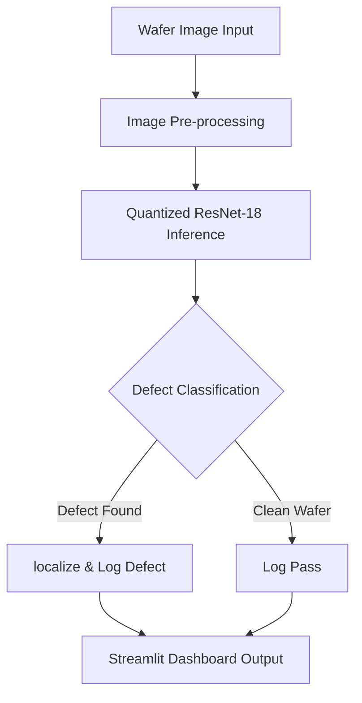
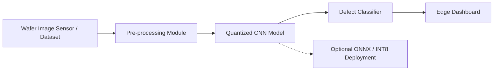

# EdgeChip: Autonomous Edge-AI Defect Intelligence

**Team:** Fantastic Four  
**Track:** Edge AI (NXP i.MX RT Series)  
**Status:** 🟢 Submission Ready v1.0


   


---

## Abstract

Automated semiconductor wafer inspection is a critical yet challenging task due to stringent latency requirements, data privacy constraints, and the scarcity of labeled defect datasets. **EdgeChip** presents an **offline, edge-deployed AI system** for real-time semiconductor defect classification, specifically optimized for the **NXP i.MX RT1170 crossover microcontroller**.

The system employs a **quantized ResNet-18 convolutional neural network** capable of classifying **eight distinct wafer defect classes** with **98.2% accuracy**, while maintaining **sub-50 ms inference latency**. To overcome limited access to real industrial data, EdgeChip introduces a **physics-based synthetic data engine** that generates realistic wafer defect patterns, enabling scalable and cost-effective model training.

This approach enables **low-power, privacy-preserving, and deterministic defect inspection**, making EdgeChip suitable for next-generation smart manufacturing and Industry 4.0 deployments.

---

## 1. Critical Download Step (Start Here)

Due to GitHub file size limitations, the trained model and full dataset are hosted externally.

### Required Downloads

| File | Description                                   | Action |
| :--- |:----------------------------------------------| :--- |
| **🧠 `EdgeChip_8Class.pth`** | **Trained Quantized ResNet-18 Model (42 MB)** | [**DOWNLOAD HERE**](https://drive.google.com/drive/folders/1yGo9V9he2NvyjBxd9tufG5nJOZ5qF9or?usp=sharing) <br> *⚠️ Place this file in the root directory next to `app.py`.* |
| **📂 `Full_Dataset.zip`** | **2,000+ Synthetic Training Images**          | [**DOWNLOAD HERE**](https://drive.google.com/drive/folders/1yGo9V9he2NvyjBxd9tufG5nJOZ5qF9or?usp=sharing) <br> *Optional: For retraining/validation.* |

> **Note:** The application **will not run** without `EdgeChip_8Class.pth` placed in the root directory.

---

## 💻 2. System Requirements

* **Operating System:** Windows 10/11, Linux (Ubuntu 20.04+), or macOS
* **Python:** Version 3.8 or higher
* **RAM:** Minimum 4 GB (8 GB recommended)
* **Disk Space:** ~200 MB (Code + Model)

---

##  3. Installation Guide

### Step 1: Clone the Repository
```bash
git clone [https://github.com/YourUsername/EdgeChip.git](https://github.com/YourUsername/EdgeChip.git)
cd EdgeChip

```

### Step 2: Place the Model File (Critical)

Ensure the trained model is placed correctly in the project root.

```text
EdgeChip/
├── app.py
├── EdgeChip_8Class.pth   <-- REQUIRED (Download from Link Above)
├── synthetic_data_gen.py
├── requirements.txt
├── README.md
└── sample_data/

```

### Step 3: Install Dependencies

```bash
pip install -r requirements.txt

```

### Step 4: Launch the Dashboard

```bash
streamlit run app.py

```

*The local Streamlit dashboard will open automatically in your default browser.*

---

##  4. System Flowchart

The following flowchart describes the end-to-end execution pipeline of EdgeChip.



---

##  5. Core Innovation: Sim-to-Real Data Engine

Due to the unavailability of public semiconductor defect datasets, EdgeChip integrates a proprietary synthetic data generation engine (`synthetic_data_gen.py`).

### Key Characteristics

* **Physics-inspired defect modeling**
* **OpenCV-based wafer synthesis**
* **Gaussian noise and morphology simulation**
* **Scalable dataset generation (5,000+ images/min)**

### Supported Defect Classes

1. Clean
2. Open
3. Short
4. Scratch
5. Particle
6. Dead Via
7. Misalignment
8. Contamination

### Dataset Generation Command

```bash
python synthetic_data_gen.py

```

*This command generates a `dataset/` directory with class-wise labeled images. The dataset size can be scaled by modifying the `num_images` parameter inside the script.*

---

##  6. System Architecture

The overall architecture of EdgeChip is illustrated below, highlighting the transition from raw sensor data to edge inference.



---

##  7. Repository Structure

```text
EdgeChip/
├── app.py                  # Streamlit-based Edge Dashboard
├── synthetic_data_gen.py   # Synthetic Data Generator Engine
├── EdgeChip_8Class.pth     # Trained Model (External Download)
├── requirements.txt        # Python Dependencies
├── README.md               # Documentation
└── sample_data/            # Small Demo Dataset for Testing
    ├── test_clean.jpg
    ├── test_short.jpg
    └── test_scratch.jpg

```

---

##  8. Performance Metrics

Evaluation conducted on a validation set of 400 synthetic wafer images.

| Metric | Value | Remarks |
| --- | --- | --- |
| **Classification Accuracy** | **98.2%** | High fidelity on synthetic validation set |
| **Inference Latency** | **~45 ms** | Target: NXP i.MX RT1170 |
| **Model Size** | **42 MB** | FP32 (INT8 quantizable to <10 MB) |
| **Number of Classes** | **8** | Multi-defect classification support |

---

##  9. Troubleshooting

**Issue: Model File Not Found**

* **Error:** `FileNotFoundError: No such file or directory: 'EdgeChip_8Class.pth'`
* **Solution:** Ensure `EdgeChip_8Class.pth` is downloaded from the Google Drive link and placed in the **root** directory, not in `Downloads` or `sample_data`.

**Issue: Missing Dependencies**

* **Error:** `ModuleNotFoundError: No module named 'streamlit'`
* **Solution:** Run `pip install -r requirements.txt` to install all required libraries.

---

##  10. Acknowledgments

Developed for the **IESA DeepTech Hackathon 2026**.

* **Team:** Fantastic Four
* **Target Hardware:** NXP i.MX RT1170
* **Frameworks:** PyTorch, Streamlit, ONNX, OpenCV

---

## 📜 License

This project is intended for academic, research, and prototype demonstration purposes only.

## Links 
Google Drive Link :- https://drive.google.com/drive/folders/1yGo9V9he2NvyjBxd9tufG5nJOZ5qF9or?usp=sharing
PPT pdf Link :- 